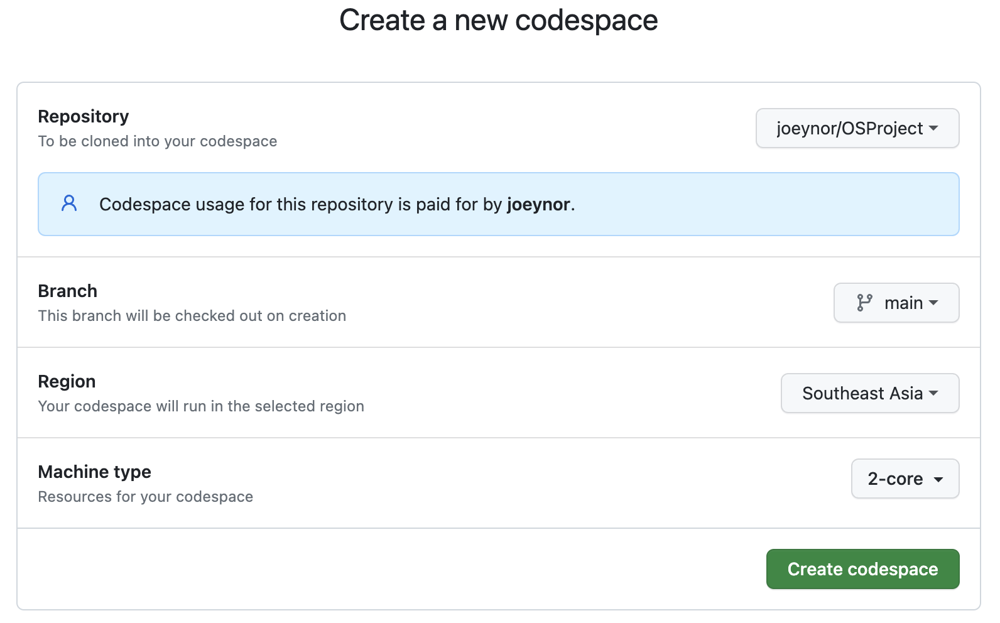
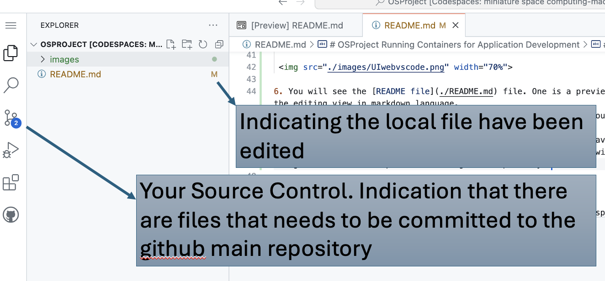
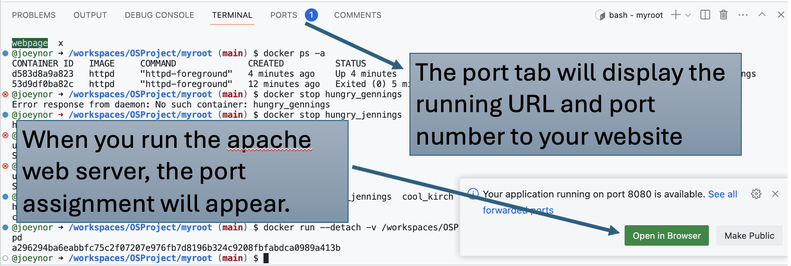
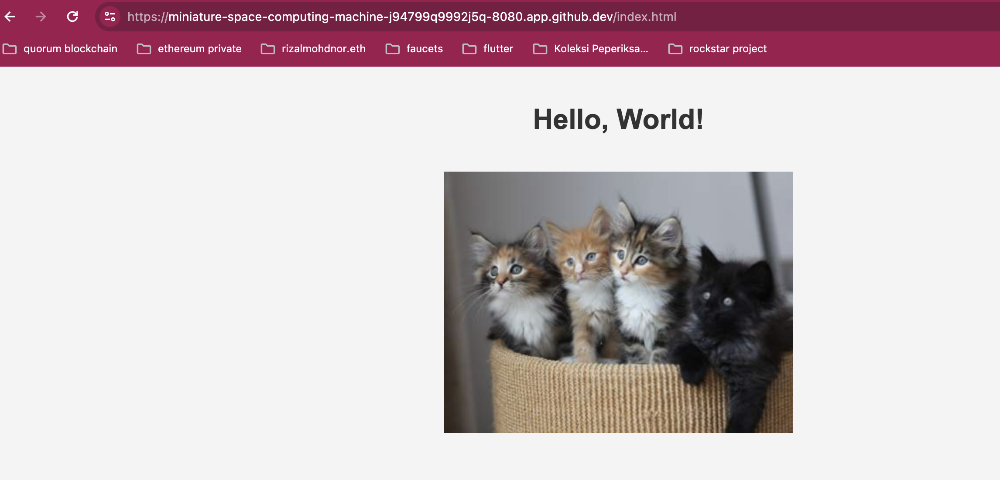

# OSProject Running Containers for Application Development

Group Name: __Sushi__

Section: __3__

Team Mates:
1. __Nadhirah binti Muhammed Najmuddin 2212502__
2. __Nur Adlina Najwa binti Rosli 2213362__
3. __Nur Amira Bt Azhari 2217176__

## Rules
1. You are allowed to have **3 group** members. *Exception* is allowed **IFF (if and only if)** you are allowed to have 4 group members if you are a **multinational** or a **multigender** group. 
2. When you complete the project, make sure to submit the repository link of your cloned project. Make sure all the files are as what you aspect in your repository. 
3. Answer all questions in the **README.md**, in your own repository. Either use the online VSCode, terminal or github to edit. Answers are expected where you see __Fill answer here__.
4. Learn how to use markdown. https://www.w3schools.io/file/markdown-introduction/

## Forking this OS project repository
1. First thing you need in doing this project is to have a github account. Make sure to sign up at https://www.github.com
2. The second thing you need is to fork the OS project repository in your own github account. 

    1. Go to https://github.com/joeynor/OSProject and click fork to copy the project into your own repository
    2. Make sure that the new fork is now in your own repository

***Questions:***

1. What is the link of the fork OSProject in your repository. ***(1 mark)*** 
```
https://github.com/sayataktahu/OSProject
```
2. How many files and folders are in this repository. ***(1 mark)*** 
```
1 file and 1 folder
```

## Exploring github codespaces

1. The next thing that we will be doing is exploring codespaces. First of all, read about codespaces https://docs.github.com/en/codespaces/overview#what-is-a-codespace
2. Then go to the link https://github.com/codespaces and we shall start a new codespace.  
3. Click on ***New codespace***.
4. Choose your own OSProject repository to start your codespace.

 

5. Once you have created you codespace, you will see the following. You might already be familiar with this, since it will look similar to VSCode. 

 

6. You will see the [README file](./README.md) file. One is a preview of how it looks like on the web, and the other is the editing view in markdown language. 
7. Edit the [README file](./README.md). Make sure you have your group details correct, ie, group name, section and team members along with their matric IDs. 
8. Once you have finish editing, click File->Save or ***ctrl-s*** to save it. 
9. After saving, you will notice an M or U next to your file. You will need to commit any changes, whenever you make changes so that it is uploaded to the github repository. 

 

10. Click on the source control, hint: its on the left side panel, and it will list down the files that have been modified or updated. Click on commit. It will then ask you "Would you like to stage all your changes and commit them directly?" Just say yes, and a new tab will appear. Type a message to log what you have done, and click on the check mark. 

 

11. After that, sync the changes to the main repository. 
12. Make sure to commit and sync your files to the main repository, or else, your work will be lost since it is not saved into the main repository when you submit your project.

***Questions:***

1. What is default OS used to run the virtual environment for codespaces. ***(1 mark)***
```
Ubuntu Linux
```
2. What are the two options of ram, disk and vcpu configuration you can have in running codespaces . ***(1 mark)*** 
```
You can choose either 2 cores, 8 GB RAM, and 32 GB storage, or 4 cores, 16 GB RAM, and 32 GB storage
```
3. Why must we commit and sync our current work on source control? ***(1 mark)*** 
```
We must do the commit action in order to save our changes to the local repository while sync action is like pulling down any changes from the remote repository that have been made since our last commit. By combines this two actions, it allows us to keep our local repository up to date with the latest changes from other contributors
```

## Exploring the Terminal

1. Look at the TERMINAL tab. Explore and run commands according to the questions below. 
2. You can include your answers as images, or cut and paste the output here. If you are cutting and pasting your answers, wrap your answers in the codeblock clause in markdown. For example, if i run the command **whoami** the the output would look like the one below.
```bash
@joeynor ➜ /workspaces/OSProject (main) $ whoami 
codespace
```


***Questions:***

Look at the TERMINAL tab. Run the following commands and provide the output here. 

1. Run the command **pwd** . ***(1 mark)*** 
```
/workspaces/OSProject
```
2. Run the command **cat /etc/passwd** . ***(1 mark)*** 
```
root:x:0:0:root:/root:/bin/bash
daemon:x:1:1:daemon:/usr/sbin:/usr/sbin/nologin
bin:x:2:2:bin:/bin:/usr/sbin/nologin
sys:x:3:3:sys:/dev:/usr/sbin/nologin
sync:x:4:65534:sync:/bin:/bin/sync
games:x:5:60:games:/usr/games:/usr/sbin/nologin
man:x:6:12:man:/var/cache/man:/usr/sbin/nologin
lp:x:7:7:lp:/var/spool/lpd:/usr/sbin/nologin
mail:x:8:8:mail:/var/mail:/usr/sbin/nologin
news:x:9:9:news:/var/spool/news:/usr/sbin/nologin
uucp:x:10:10:uucp:/var/spool/uucp:/usr/sbin/nologin
proxy:x:13:13:proxy:/bin:/usr/sbin/nologin
www-data:x:33:33:www-data:/var/www:/usr/sbin/nologin
backup:x:34:34:backup:/var/backups:/usr/sbin/nologin
list:x:38:38:Mailing List Manager:/var/list:/usr/sbin/nologin
irc:x:39:39:ircd:/var/run/ircd:/usr/sbin/nologin
gnats:x:41:41:Gnats Bug-Reporting System (admin):/var/lib/gnats:/usr/sbin/nologin
nobody:x:65534:65534:nobody:/nonexistent:/usr/sbin/nologin
_apt:x:100:65534::/nonexistent:/usr/sbin/nologin
systemd-timesync:x:101:101:systemd Time Synchronization,,,:/run/systemd:/usr/sbin/nologin
systemd-network:x:102:103:systemd Network Management,,,:/run/systemd:/usr/sbin/nologin
systemd-resolve:x:103:104:systemd Resolver,,,:/run/systemd:/usr/sbin/nologin
messagebus:x:104:105::/nonexistent:/usr/sbin/nologin
codespace:x:1000:1000::/home/codespace:/bin/bash
sshd:x:105:65534::/run/sshd:/usr/sbin/nologin
```
3. Run the command **df** . ***(1 mark)*** 
```
Filesystem     1K-blocks     Used Available Use% Mounted on
overlay         32847680 10411660  20741920  34% /
tmpfs              65536        0     65536   0% /dev
shm                65536        8     65528   1% /dev/shm
/dev/root       30298176 24510512   5771280  81% /vscode
/dev/loop3      32847680 10411660  20741920  34% /workspaces
/dev/sdb1       46127956    10668  43741712   1% /tmp
```
4. Run the command **du** . ***(1 mark)*** 
```
1972    ./images
8       ./.git/info
4       ./.git/branches
4       ./.git/lfs/tmp
8       ./.git/lfs
8       ./.git/refs/heads
12      ./.git/refs/remotes/origin
16      ./.git/refs/remotes
4       ./.git/refs/tags
32      ./.git/refs
8       ./.git/logs/refs/heads
12      ./.git/logs/refs/remotes/origin
16      ./.git/logs/refs/remotes
28      ./.git/logs/refs
36      ./.git/logs
16      ./.git/objects/f7
8       ./.git/objects/c3
12      ./.git/objects/68
12      ./.git/objects/23
20      ./.git/objects/0d
28      ./.git/objects/5f
12      ./.git/objects/e8
12      ./.git/objects/4d
12      ./.git/objects/59
4       ./.git/objects/info
8       ./.git/objects/fe
12      ./.git/objects/ea
12      ./.git/objects/9c
16      ./.git/objects/38
20      ./.git/objects/aa
12      ./.git/objects/cc
8       ./.git/objects/ee
20      ./.git/objects/83
24      ./.git/objects/86
12      ./.git/objects/2c
16      ./.git/objects/65
20      ./.git/objects/85
16      ./.git/objects/b2
12      ./.git/objects/50
8       ./.git/objects/24
12      ./.git/objects/b5
12      ./.git/objects/1c
12      ./.git/objects/ca
12      ./.git/objects/94
12      ./.git/objects/70
12      ./.git/objects/7f
12      ./.git/objects/05
24      ./.git/objects/a4
12      ./.git/objects/14
8       ./.git/objects/58
12      ./.git/objects/ad
8       ./.git/objects/f4
16      ./.git/objects/a3
16      ./.git/objects/47
16      ./.git/objects/93
20      ./.git/objects/73
12      ./.git/objects/e3
20      ./.git/objects/d4
20      ./.git/objects/a5
20      ./.git/objects/c0
16      ./.git/objects/cd
40      ./.git/objects/a1
20      ./.git/objects/1d
20      ./.git/objects/87
8       ./.git/objects/01
20      ./.git/objects/69
16      ./.git/objects/e7
12      ./.git/objects/a9
12      ./.git/objects/67
20      ./.git/objects/d3
16      ./.git/objects/74
12      ./.git/objects/5c
12      ./.git/objects/75
12      ./.git/objects/3d
16      ./.git/objects/f6
20      ./.git/objects/cb
44      ./.git/objects/6e
24      ./.git/objects/0b
16      ./.git/objects/b4
12      ./.git/objects/9f
12      ./.git/objects/ba
12      ./.git/objects/97
20      ./.git/objects/6b
16      ./.git/objects/04
8       ./.git/objects/91
16      ./.git/objects/4a
12      ./.git/objects/d0
16      ./.git/objects/90
12      ./.git/objects/8b
12      ./.git/objects/d2
28      ./.git/objects/48
12      ./.git/objects/98
12      ./.git/objects/7d
12      ./.git/objects/18
16      ./.git/objects/e9
16      ./.git/objects/72
12      ./.git/objects/ae
20      ./.git/objects/61
12      ./.git/objects/cf
12      ./.git/objects/ed
24      ./.git/objects/79
20      ./.git/objects/b9
36      ./.git/objects/62
8       ./.git/objects/fa
28      ./.git/objects/af
24      ./.git/objects/b6
12      ./.git/objects/c7
12      ./.git/objects/d1
12      ./.git/objects/88
20      ./.git/objects/11
20      ./.git/objects/44
12      ./.git/objects/36
12      ./.git/objects/3b
16      ./.git/objects/b3
8       ./.git/objects/52
20      ./.git/objects/be
8       ./.git/objects/1b
24      ./.git/objects/9a
20      ./.git/objects/64
20      ./.git/objects/43
24      ./.git/objects/17
12      ./.git/objects/0e
32      ./.git/objects/a6
12      ./.git/objects/b1
12      ./.git/objects/13
16      ./.git/objects/7b
12      ./.git/objects/6a
12      ./.git/objects/e2
16      ./.git/objects/eb
16      ./.git/objects/3f
12      ./.git/objects/57
28      ./.git/objects/2a
24      ./.git/objects/fb
24      ./.git/objects/81
16      ./.git/objects/60
12      ./.git/objects/54
16      ./.git/objects/ab
20      ./.git/objects/e1
12      ./.git/objects/25
12      ./.git/objects/7c
12      ./.git/objects/22
16      ./.git/objects/71
8       ./.git/objects/4f
12      ./.git/objects/08
8       ./.git/objects/33
12      ./.git/objects/f0
24      ./.git/objects/f3
12      ./.git/objects/8d
28      ./.git/objects/5b
20      ./.git/objects/e4
12      ./.git/objects/84
20      ./.git/objects/53
12      ./.git/objects/2e
12      ./.git/objects/78
12      ./.git/objects/21
8       ./.git/objects/41
12      ./.git/objects/7a
36      ./.git/objects/dc
1828    ./.git/objects/pack
20      ./.git/objects/bf
20      ./.git/objects/8a
8       ./.git/objects/2b
20      ./.git/objects/5d
28      ./.git/objects/03
8       ./.git/objects/49
8       ./.git/objects/c6
8       ./.git/objects/4b
12      ./.git/objects/20
12      ./.git/objects/45
24      ./.git/objects/d8
8       ./.git/objects/3a
20      ./.git/objects/b7
16      ./.git/objects/b0
8       ./.git/objects/96
16      ./.git/objects/f2
24      ./.git/objects/fd
20      ./.git/objects/ce
12      ./.git/objects/02
12      ./.git/objects/10
12      ./.git/objects/46
12      ./.git/objects/07
40      ./.git/objects/fc
12      ./.git/objects/29
24      ./.git/objects/b8
16      ./.git/objects/d9
12      ./.git/objects/ff
12      ./.git/objects/c8
12      ./.git/objects/8c
12      ./.git/objects/bb
12      ./.git/objects/ec
12      ./.git/objects/e5
4592    ./.git/objects
68      ./.git/hooks
4784    ./.git
6780    .
```
5. Run the command **ls** . ***(1 mark)*** 
```
README.md  images
```
6. Run the command **ls -asl** . ***(1 mark)***
```
total 44
 4 drwxrwxrwx+ 4 codespace root  4096 Jun 10 06:59 .
 4 drwxr-xrwx+ 5 codespace root  4096 Jun 10 06:59 ..
 4 drwxrwxrwx+ 9 codespace root  4096 Jun 10 08:01 .git
28 -rw-rw-rw-  1 codespace root 24721 Jun 10 08:21 README.md
 4 drwxrwxrwx+ 2 codespace root  4096 Jun 10 06:59 images
```
7. Run the command **free -h** . ***(1 mark)*** 
```
              total        used        free      shared  buff/cache   available
Mem:          7.7Gi       1.6Gi       2.5Gi       1.0Mi       3.6Gi       5.8Gi
Swap:            0B          0B          0B
```
8. Run the command **cat /proc/cpuinfo** . ***(1 mark)*** 
```
processor       : 0
vendor_id       : AuthenticAMD
cpu family      : 25
model           : 1
model name      : AMD EPYC 7763 64-Core Processor
stepping        : 1
microcode       : 0xffffffff
cpu MHz         : 3243.462
cache size      : 512 KB
physical id     : 0
siblings        : 2
core id         : 0
cpu cores       : 1
apicid          : 0
initial apicid  : 0
fpu             : yes
fpu_exception   : yes
cpuid level     : 13
wp              : yes
flags           : fpu vme de pse tsc msr pae mce cx8 apic sep mtrr pge mca cmov pat pse36 clflush mmx fxsr sse sse2 ht syscall nx mmxext fxsr_opt pdpe1gb rdtscp lm constant_tsc rep_good nopl tsc_reliable nonstop_tsc cpuid extd_apicid aperfmperf pni pclmulqdq ssse3 fma cx16 pcid sse4_1 sse4_2 movbe popcnt aes xsave avx f16c rdrand hypervisor lahf_lm cmp_legacy svm cr8_legacy abm sse4a misalignsse 3dnowprefetch osvw topoext invpcid_single vmmcall fsgsbase bmi1 avx2 smep bmi2 erms invpcid rdseed adx smap clflushopt clwb sha_ni xsaveopt xsavec xgetbv1 xsaves clzero xsaveerptr rdpru arat npt nrip_save tsc_scale vmcb_clean flushbyasid decodeassists pausefilter pfthreshold v_vmsave_vmload umip vaes vpclmulqdq rdpid fsrm
bugs            : sysret_ss_attrs null_seg spectre_v1 spectre_v2 spec_store_bypass srso
bogomips        : 4890.85
TLB size        : 2560 4K pages
clflush size    : 64
cache_alignment : 64
address sizes   : 48 bits physical, 48 bits virtual
power management:


```
9. Run the command **top** and type **q** to quit. ***(1 mark)***
```
Tasks:  22 total,   1 running,  21 sleeping,   0 stopped,   0 zombie
%Cpu(s):  0.0 us,  7.1 sy,  0.0 ni, 92.9 id,  0.0 wa,  0.0 hi,  0.0 si,  0.0 st
top - 08:23:20 up  1:27,  0 users,  load average: 0.13, 0.33, 0.40
top - 08:23:23 up  1:28,  0 users,  load average: 0.12, 0.33, 0.40
top - 08:23:26 up  1:28,  0 users,  load average: 0.12, 0.33, 0.40
%Cpu(s):  3.9 us,  3.4 sy,  0.0 ni, 92.8 id,  0.0 wa,  0.0 hi,  0.0 si,  0.0 st
top - 08:23:29 up  1:28,  0 users,  load average: 0.11, 0.32, 0.39
MiB Mem :   7929.6 total,   2565.5 free,   1634.5 used,   3729.6 buff/cache
top - 08:23:32 up  1:28,  0 users,  load average: 0.11, 0.32, 0.39
MiB Mem :   7929.6 total,   2526.0 free,   1673.9 used,   3729.7 buff/cache
top - 08:23:35 up  1:28,  0 users,  load average: 0.10, 0.32, 0.39
Tasks:  25 total,   1 running,  24 sleeping,   0 stopped,   0 zombie
top - 08:23:38 up  1:28,  0 users,  load average: 0.17, 0.33, 0.39
Tasks:  22 total,   1 running,  21 sleeping,   0 stopped,   0 zombie
top - 08:23:44 up  1:28,  0 users,  load average: 0.16, 0.32, 0.39
MiB Mem :   7929.6 total,   2526.5 free,   1673.3 used,   3729.8 buff/cache
top - 08:23:47 up  1:28,  0 users,  load average: 0.16, 0.32, 0.39
MiB Mem :   7929.6 total,   2537.6 free,   1662.1 used,   3729.9 buff/cache
top - 08:23:50 up  1:28,  0 users,  load average: 0.14, 0.32, 0.39
Tasks:  25 total,   1 running,  24 sleeping,   0 stopped,   0 zombie
top - 08:23:53 up  1:28,  0 users,  load average: 0.13, 0.31, 0.39
Tasks:  22 total,   1 running,  21 sleeping,   0 stopped,   0 zombie
top - 08:23:56 up  1:28,  0 users,  load average: 0.13, 0.31, 0.39
MiB Mem :   7929.6 total,   2559.1 free,   1640.4 used,   3730.1 buff/cache
top - 08:23:59 up  1:28,  0 users,  load average: 0.12, 0.31, 0.38
MiB Mem :   7929.6 total,   2541.4 free,   1658.0 used,   3730.1 buff/cache
top - 08:24:02 up  1:28,  0 users,  load average: 0.12, 0.31, 0.38
MiB Mem :   7929.6 total,   2537.2 free,   1662.2 used,   3730.2 buff/cache
top - 08:24:05 up  1:28,  0 users,  load average: 0.11, 0.30, 0.38
Tasks:  25 total,   1 running,  24 sleeping,   0 stopped,   0 zombie
top - 08:24:08 up  1:28,  0 users,  load average: 0.10, 0.30, 0.38
Tasks:  22 total,   2 running,  20 sleeping,   0 stopped,   0 zombie
top - 08:24:11 up  1:28,  0 users,  load average: 0.10, 0.30, 0.38
Tasks:  22 total,   1 running,  21 sleeping,   0 stopped,   0 zombie
top - 08:24:14 up  1:28,  0 users,  load average: 0.09, 0.29, 0.38
MiB Mem :   7929.6 total,   2545.6 free,   1653.6 used,   3730.4 buff/cache
top - 08:24:17 up  1:28,  0 users,  load average: 0.09, 0.29, 0.38

top - 08:24:20 up  1:28,  0 users,  load average: 0.09, 0.29, 0.37
Tasks:  27 total,   2 running,  25 sleeping,   0 stopped,   0 zombie
top - 08:24:23 up  1:29,  0 users,  load average: 0.08, 0.28, 0.37
Tasks:  22 total,   1 running,  21 sleeping,   0 stopped,   0 zombie
top - 08:24:26 up  1:29,  0 users,  load average: 0.08, 0.28, 0.37
MiB Mem :   7929.6 total,   2538.2 free,   1660.8 used,   3730.6 buff/cache
top - 08:24:29 up  1:29,  0 users,  load average: 0.07, 0.28, 0.37
MiB Mem :   7929.6 total,   2536.2 free,   1662.7 used,   3730.6 buff/cache
top - 08:24:32 up  1:29,  0 users,  load average: 0.07, 0.28, 0.37
top - 08:24:35 up  1:29,  0 users,  load average: 0.07, 0.27, 0.37
top - 08:24:38 up  1:29,  0 users,  load average: 0.06, 0.27, 0.36
Tasks:  22 total,   1 running,  21 sleeping,   0 stopped,   0 zombie
top - 08:24:41 up  1:29,  0 users,  load average: 0.06, 0.27, 0.36
MiB Mem :   7929.6 total,   2527.4 free,   1671.3 used,   3730.8 buff/cache
top - 08:24:44 up  1:29,  0 users,  load average: 0.06, 0.26, 0.36
top - 08:24:47 up  1:29,  0 users,  load average: 0.06, 0.26, 0.36
top - 08:24:50 up  1:29,  0 users,  load average: 0.05, 0.26, 0.36
Tasks:  25 total,   1 running,  24 sleeping,   0 stopped,   0 zombie
top - 08:24:53 up  1:29,  0 users,  load average: 0.05, 0.25, 0.36
Tasks:  22 total,   1 running,  21 sleeping,   0 stopped,   0 zombie
top - 08:24:56 up  1:29,  0 users,  load average: 0.05, 0.25, 0.36
MiB Mem :   7929.6 total,   2544.5 free,   1654.0 used,   3731.1 buff/cache
top - 08:24:59 up  1:29,  0 users,  load average: 0.04, 0.25, 0.36
MiB Mem :   7929.6 total,   2544.2 free,   1654.2 used,   3731.2 buff/cache
top - 08:25:02 up  1:29,  0 users,  load average: 0.04, 0.25, 0.36
MiB Mem :   7929.6 total,   2532.3 free,   1666.0 used,   3731.2 buff/cache
%Cpu(s):  3.8 us,  4.3 sy,  0.0 ni, 91.5 id,  0.3 wa,  0.0 hi,  0.0 si,  0.0 st
MiB Mem :   7929.6 total,   2521.1 free,   1677.0 used,   3731.4 buff/cache
top - 08:29:01 up  1:33,  0 users,  load average: 0.36, 0.30, 0.35
Tasks:  22 total,   1 running,  21 sleeping,   0 stopped,   0 zombie
%Cpu(s):  0.0 us,  0.0 sy,  0.0 ni,100.0 id,  0.0 wa,  0.0 hi,  0.0 si,  0.0 st
top - 08:29:04 up  1:33,  0 users,  load average: 0.73, 0.38, 0.38
MiB Swap:      0.0 total,      0.0 free,      0.0 used.   5930.7 avail Mem 
top - 08:29:07 up  1:33,  0 users,  load average: 0.73, 0.38, 0.38
Tasks:  25 total,   1 running,  24 sleeping,   0 stopped,   0 zombie
top - 08:29:10 up  1:33,  0 users,  load average: 0.67, 0.37, 0.38
Tasks:  22 total,   1 running,  21 sleeping,   0 stopped,   0 zombie
top - 08:29:13 up  1:33,  0 users,  load average: 0.62, 0.37, 0.37
Tasks:  22 total,   2 running,  20 sleeping,   0 stopped,   0 zombie
top - 08:29:16 up  1:33,  0 users,  load average: 0.62, 0.37, 0.37
top - 08:29:19 up  1:33,  0 users,  load average: 0.57, 0.36, 0.37
top - 08:29:22 up  1:33,  0 users,  load average: 0.57, 0.36, 0.37
Tasks:  25 total,   1 running,  24 sleeping,   0 stopped,   0 zombie
top - 08:29:25 up  1:34,  0 users,  load average: 0.52, 0.35, 0.37
Tasks:  22 total,   1 running,  21 sleeping,   0 stopped,   0 zombie
%Cpu(s):  4.8 us,  4.0 sy,  0.0 ni, 90.5 id,  0.5 wa,  0.0 hi,  0.2 si,  0.0 st
top - 08:29:28 up  1:34,  0 users,  load average: 0.48, 0.35, 0.37
MiB Swap:      0.0 total,      0.0 free,      0.0 used.   5929.7 avail Mem 
%Cpu(s):  4.4 us,  3.9 sy,  0.0 ni, 91.6 id,  0.0 wa,  0.0 hi,  0.2 si,  0.0 st
top - 08:29:31 up  1:34,  0 users,  load average: 0.48, 0.35, 0.37
MiB Swap:      0.0 total,      0.0 free,      0.0 used.   5922.5 avail Mem 
%Cpu(s):  3.7 us,  4.5 sy,  0.0 ni, 91.5 id,  0.3 wa,  0.0 hi,  0.0 si,  0.0 st
top - 08:29:34 up  1:34,  0 users,  load average: 0.44, 0.34, 0.36
top - 08:29:37 up  1:34,  0 users,  load average: 0.44, 0.34, 0.36
Tasks:  25 total,   1 running,  24 sleeping,   0 stopped,   0 zombie
%Cpu(s):  7.1 us,  5.9 sy,  0.0 ni, 87.1 id,  0.0 wa,  0.0 hi,  0.0 si,  0.0 st
top - 08:29:40 up  1:34,  0 users,  load average: 0.40, 0.34, 0.36
Tasks:  22 total,   1 running,  21 sleeping,   0 stopped,   0 zombie
%Cpu(s):  2.5 us,  2.5 sy,  0.0 ni, 94.5 id,  0.3 wa,  0.0 hi,  0.2 si,  0.0 st
top - 08:29:43 up  1:34,  0 users,  load average: 0.37, 0.33, 0.36
MiB Swap:      0.0 total,      0.0 free,      0.0 used.   5937.9 avail Mem 
%Cpu(s):  4.7 us,  3.8 sy,  0.0 ni, 91.3 id,  0.0 wa,  0.0 hi,  0.2 si,  0.0 st
top - 08:29:46 up  1:34,  0 users,  load average: 0.37, 0.33, 0.36
MiB Swap:      0.0 total,      0.0 free,      0.0 used.   5933.9 avail Mem 
%Cpu(s):  5.0 us,  4.5 sy,  0.0 ni, 90.1 id,  0.3 wa,  0.0 hi,  0.0 si,  0.0 st
top - 08:29:49 up  1:34,  0 users,  load average: 0.34, 0.32, 0.36
MiB Swap:      0.0 total,      0.0 free,      0.0 used.   5930.8 avail Mem 
top - 08:29:52 up  1:34,  0 users,  load average: 0.34, 0.32, 0.36
Tasks:  25 total,   1 running,  24 sleeping,   0 stopped,   0 zombie
%Cpu(s):  4.4 us,  3.7 sy,  0.0 ni, 91.8 id,  0.0 wa,  0.0 hi,  0.2 si,  0.0 st
top - 08:29:55 up  1:34,  0 users,  load average: 0.31, 0.32, 0.36
Tasks:  22 total,   1 running,  21 sleeping,   0 stopped,   0 zombie
%Cpu(s):  3.7 us,  2.2 sy,  0.0 ni, 93.1 id,  0.8 wa,  0.0 hi,  0.2 si,  0.0 st
top - 08:29:58 up  1:34,  0 users,  load average: 0.29, 0.31, 0.35
MiB Swap:      0.0 total,      0.0 free,      0.0 used.   5958.6 avail Mem 
%Cpu(s):  4.7 us,  4.7 sy,  0.0 ni, 90.4 id,  0.0 wa,  0.0 hi,  0.2 si,  0.0 st
top - 08:30:01 up  1:34,  0 users,  load average: 0.29, 0.31, 0.35
MiB Swap:      0.0 total,      0.0 free,      0.0 used.   5927.3 avail Mem 
%Cpu(s):  2.5 us,  3.0 sy,  0.0 ni, 94.2 id,  0.3 wa,  0.0 hi,  0.0 si,  0.0 st
top - 08:30:04 up  1:34,  0 users,  load average: 0.27, 0.31, 0.35
  30798 codespa+  20   0   21.6g 404088  55296 S   1.3   5.0   0:49.12 node              
%Cpu(s):  3.8 us,  3.3 sy,  0.0 ni, 92.8 id,  0.0 wa,  0.0 hi,  0.0 si,  0.0 st
top - 08:30:07 up  1:34,  0 users,  load average: 0.27, 0.31, 0.35
Tasks:  25 total,   1 running,  24 sleeping,   0 stopped,   0 zombie
%Cpu(s):  5.7 us,  4.7 sy,  0.0 ni, 89.3 id,  0.3 wa,  0.0 hi,  0.0 si,  0.0 st
top - 08:30:10 up  1:34,  0 users,  load average: 0.24, 0.30, 0.35
Tasks:  22 total,   1 running,  21 sleeping,   0 stopped,   0 zombie
%Cpu(s):  4.7 us,  2.7 sy,  0.0 ni, 92.3 id,  0.3 wa,  0.0 hi,  0.0 si,  0.0 st
top - 08:30:13 up  1:34,  0 users,  load average: 0.30, 0.31, 0.35
MiB Swap:      0.0 total,      0.0 free,      0.0 used.   5943.8 avail Mem 
%Cpu(s):  4.0 us,  3.7 sy,  0.0 ni, 92.3 id,  0.0 wa,  0.0 hi,  0.0 si,  0.0 st
top - 08:30:16 up  1:34,  0 users,  load average: 0.30, 0.31, 0.35
MiB Swap:      0.0 total,      0.0 free,      0.0 used.   5937.6 avail Mem 
%Cpu(s):  2.7 us,  3.0 sy,  0.0 ni, 94.0 id,  0.3 wa,  0.0 hi,  0.0 si,  0.0 st
top - 08:30:19 up  1:34,  0 users,  load average: 0.28, 0.31, 0.35
MiB Swap:      0.0 total,      0.0 free,      0.0 used.   5929.2 avail Mem 
%Cpu(s):  3.4 us,  4.0 sy,  0.0 ni, 92.6 id,  0.0 wa,  0.0 hi,  0.0 si,  0.0 st
top - 08:30:22 up  1:34,  0 users,  load average: 0.28, 0.31, 0.35
Tasks:  25 total,   1 running,  24 sleeping,   0 stopped,   0 zombie
%Cpu(s):  2.0 us,  2.5 sy,  0.0 ni, 95.3 id,  0.2 wa,  0.0 hi,  0.0 si,  0.0 st
top - 08:30:25 up  1:35,  0 users,  load average: 0.26, 0.30, 0.35
Tasks:  22 total,   1 running,  21 sleeping,   0 stopped,   0 zombie
%Cpu(s):  2.7 us,  3.8 sy,  0.0 ni, 93.2 id,  0.3 wa,  0.0 hi,  0.0 si,  0.0 st
MiB Mem :   7929.6 total,   2544.6 free,   1646.9 used,   3738.1 buff/cache
MiB Swap:      0.0 total,      0.0 free,      0.0 used.   5966.6 avail Mem 

      1 codespa+  20   0    1136    640    640 S   0.0   0.0   0:00.13 docker-init       
  30798 codespa+  20   0   21.6g 397284  55296 S   1.3   4.9   0:49.68 node
```
10. Run the command **uname -a**. ***(1 mark)*** 
```
Linux codespaces-771f99 6.5.0-1021-azure #22~22.04.1-Ubuntu SMP Tue Apr 30 16:08:18 UTC 2024 x86_64 x86_64 x86_64 GNU/Linux
```
11. What is the available free memory in the system. ***(1 mark)*** 
```
 2.5Gi  
```
12. What is the available disk space mounted on /workspace. ***(1 mark)*** 
```
20741920 KB or about 21 GB

```
13. Name the version and hardware architecture of the linux Virtual environment. ***(1 mark)*** 
```
version - 6.5.0-1021-azure 
hardware architecture - x86_64
```
14. What is the difference between **ls** vs **ls -asl**. ***(1 mark)*** 
```
The ls command lists directory contents, while ls -asl provides a more detailed listing including hidden files and detailed file information (permissions, number of links, owner, group, size, and timestamp)
```
15. What is the TLB size of the Virtual CPU. ***(1 mark)*** 
```
 2560 4K pages 
```
16. What is the CPU speed of the Virtual CPU. ***(1 mark)***
```
3243.044
```
17. What is the top running process that consumes the most CPU cycles. ***(1 mark)*** 
```
  3.8 
```

## Running your own container instance.

1. At the terminal, run a linux instance. By typing the following command. 
```
docker pull debian
docker run --detach -it debian
```
2. This will run the debian container. To check if the debian container is running, type
```bash
@joeynor ➜ /workspaces/OSProject (main) $ docker ps -a
CONTAINER ID   IMAGE     COMMAND   CREATED         STATUS         PORTS     NAMES
f65be1987f84   debian    "bash"    4 minutes ago   Up 4 minutes             romantic_jackson
```

3. Keep note of the name used by your container, this is usually given random names unless you specify your own name. Now run a bash command on the container. Make sure you use the name of your container instead of the one shown here. 
```bash
docker exec -i -t romantic_jackson /bin/bash
```

4. Create a file on the container. First you must make sure you are in the bash command prompt of the container. The container is new, and does not have any software other than the debian OS. To create a new file, you will need an editor installed. In the bash shell of the container, run the package manager apt-get to install nano text editor. 

```bash
root@f65be1987f84:~# apt-get update      

root@f65be1987f84:~# apt-get install nano

root@f65be1987f84:~# cd /root

root@f65be1987f84:~# nano helloworld.txt
```

5. Edit your helloworld.txt, create your messsage and save by typing ctrl-X. Once saved, explore using the container to see where the file is located. Then exit the shell, by typing **exit**.

6. Stop the container and run **docker ps -a**, and restart the container again. Is your file in the container still available?
```bash 
@joeynor ➜ /workspaces/OSProject (main) $ docker stop romantic_jackson

@joeynor ➜ /workspaces/OSProject (main) $ docker ps -a
CONTAINER ID   IMAGE     COMMAND   CREATED          STATUS                        PORTS     NAMES
f65be1987f84   debian    "bash"    19 minutes ago   Exited (137) 18 seconds ago             romantic_jackson

@joeynor ➜ /workspaces/OSProject (main) $ docker restart romantic_jackson
```

7. Stop the container and delete the container. What happened to your helloworld.txt?

```bash 
@joeynor ➜ /workspaces/OSProject (main) $ docker stop romantic_jackson

@joeynor ➜ /workspaces/OSProject (main) $ docker ps -a
CONTAINER ID   IMAGE     COMMAND   CREATED          STATUS                        PORTS     NAMES
f65be1987f84   debian    "bash"    19 minutes ago   Exited (137) 18 seconds ago             romantic_jackson

@joeynor ➜ /workspaces/OSProject (main) $ docker rm romantic_jackson
```

***Questions:***

1. Are files in the container persistent. Why not?. ***(1 mark)*** 
```bash
Answer
```
2. Can we run two, or three instances of debian linux? . ***(1 mark)*** 
```bash
Answer
```

## Running your own container with persistent storage

1. In the previous experiment, you might have notice that containers are not persistent. To make storage persistent, you will need to mount them. 
At the terminal, create a new directory called **myroot**, and run a instance of debian linux and mount myroot to the container. Find out the exact path of my root, and mount it as the root folder in the debian container. 
2. Create a file in /root on the container, the files should also appear in myroot of your host VM.

```bash 
@joeynor ➜ /workspaces/OSProject (main) $ mkdir myroot
@joeynor ➜ /workspaces/OSProject (main) $ cd myroot/
@joeynor ➜ /workspaces/OSProject/myroot (main) $ pwd
/workspaces/OSProject/myroot

@joeynor ➜ /workspaces/OSProject/myroot (main) $ docker run --detach -it -v /workspaces/OSProject/myroot:/root debian
```

***Questions:***

1. Check the permission of the files created in myroot, what user and group is the files created in docker container on the host virtual machine? . ***(2 mark)*** __Fill answer here__.
2. Can you change the permission of the files to user codespace.  You will need this to be able to commit and get points for this question. ***(2 mark)***
```bash
//use sudo and chown
sudo chown -R codespace:codespace myroot

```
*** __Fill answer here__.***

## You are on your own, create your own static webpage

1. Create a directory called webpage in your host machine
2. Inside the directory, create a page index.html, with any content you would like
3. Then, run the apache webserver and mount the webpage directory to it. Hint:
```bash
## the -p 8080:80 flag points the host port 8080 to the container port 80

docker run --detach -v /workspaces/OSProject/webpage:/usr/local/apache2/htdocs/ -p 8080:80 httpd
```

4. If it works, codespace will trigger a port assignment and provide a URL for you to access your webpage like the one below.

 


5. You can also see the Port in the **PORTS** tab, next to the terminal tab.

6. You can then access your website by adding an index.html towards the end of your url link, like the one below. 

 

***Questions:***

1. What is the permission of folder /usr/local/apache/htdocs and what user and group owns the folder? . ***(2 mark)*** __Fill answer here__.
2. What port is the apache web server running. ***(1 mark)*** __Fill answer here__.
3. What port is open for http protocol on the host machine? ***(1 mark)*** __Fill answer here__.

## Create SUB Networks

1. In docker, you can create your own private networks where you can run multiple services, in this part, we will create two networks, one called bluenet and the other is rednet
2. Run the docker create network to create you networks like the ones below
```bash
## STEP 1:
## Create Networks ##
docker network create bluenet
docker network create rednet`

## STEP 2: (automatically running)
## Create (1) Container in background called "c1" running busybox image ##
docker run -itd --net bluenet --name c1 busybox sh
docker run -itd --net rednet --name c2 busybox sh
```
***Questions:***

1. Describe what is busybox and what is command switch **--name** is for? . ***(2 mark)*** __Fill answer here__.
2. Explore the network using the command ```docker network ls```, show the output of your terminal. ***(1 mark)*** __Fill answer here__.
3. Using ```docker inspect c1``` and ```docker inspect c2``` inscpect the two network. What is the gateway of bluenet and rednet.? ***(1 mark)*** __Fill answer here__.
4. What is the network address for the running container c1 and c2? ***(1 mark)*** __Fill answer here__.
5. Using the command ```docker exec c1 ping c2```, which basically tries to do a ping from container c1 to c2. Are you able to ping? Show your output . ***(1 mark)*** __Fill answer here__.

## Bridging two SUB Networks
1. Let's try this again by creating a network to bridge the two containers in the two subnetworks
```
docker network create bridgenet
docker network connect bridgenet c1
docker network connect bridgenet c2
docker exec c1 ping c2
```
***Questions:***

1. Are you able to ping? Show your output . ***(1 mark)*** __Fill answer here__.
2. What is different from the previous ping in the section above? ***(1 mark)*** __Fill answer here__.

## Intermediate Level (10 marks bonus)

### Node.js and MySQL in Docker Containers

This guide will help you set up a simple Node.js website that retrieves a random row from a MySQL database. Both the MySQL server and the Node.js server will run in separate Docker containers on two separate networks. Your job is to make it work by making the two containers in two separate network bridged together.

#### Step 1: Set Up the Docker Network

Create a Docker network to for the two containers.
For mysql, call it **mysqlnet** for nodejs call it **nodejsnet** .

#### Step 2: Set Up the MySQL Container

Run a MySQL container on the created network.

```sh
docker run --name mysql-container --network mysqlnet -e MYSQL_ROOT_PASSWORD=rootpassword -e MYSQL_DATABASE=mydatabase -e MYSQL_USER=myuser -e MYSQL_PASSWORD=mypassword -d mysql:latest
```

#### Step 3: Set Up the Node.js Container

1. **Create a directory for your Node.js application and initialize it.**

    ```sh
    mkdir nodejs-app
    cd nodejs-app
    npm init -y
    npm install express mysql
    ```

2. **Create a file named `index.js` with the following content:**

    ```js
    const express = require('express');
    const mysql = require('mysql');

    const app = express();
    const port = 3000;

    // Create a MySQL connection
    const connection = mysql.createConnection({
      host: 'mysql-container',
      user: 'myuser',
      password: 'mypassword',
      database: 'mydatabase'
    });

    // Connect to MySQL
    connection.connect((err) => {
      if (err) {
        console.error('Error connecting to MySQL:', err);
        return;
      }
      console.log('Connected to MySQL');
    });

    // Define a route to get a random row
    app.get('/random', (req, res) => {
      const query = 'SELECT * FROM mytable ORDER BY RAND() LIMIT 1';
      connection.query(query, (err, results) => {
        if (err) {
          console.error('Error executing query:', err);
          res.status(500).send('Server Error');
          return;
        }
        res.json(results[0]);
      });
    });

    // Start the server
    app.listen(port, () => {
      console.log(`Server running at http://localhost:${port}`);
    });
    ```

3. **Create a Dockerfile for the Node.js application:**

    ```Dockerfile
    # Use the official Node.js image
    FROM node:14

    # Create and change to the app directory
    WORKDIR /usr/src/app

    # Copy application dependency manifests to the container image
    COPY package*.json ./

    # Install production dependencies
    RUN npm install

    # Copy local code to the container image
    COPY . .

    # Run the web service on container startup
    CMD [ "node", "index.js" ]
    ```

#### Step 4: Build and Run the Node.js Container

1. **Build the Docker image for the Node.js application.**

    ```sh
    docker build -t nodejs-app .
    ```

2. **Run the Node.js container on the same network as the MySQL container.**

    ```sh
    docker run --name nodejs-container --network nodejsnet -p 3000:3000 -d nodejs-app
    ```

#### Step 5: Test the Setup

You can now test the setup by accessing the Node.js application in your browser or using a tool like `curl`:

```sh
curl http://localhost:3000/random
```

#### Step 6: Ensure `mytable` is Populated

Make sure you have created the `mytable` table and populated it with some data in your MySQL database for the above steps to work correctly.

You can use the following SQL commands to create and populate the table (run these commands in the MySQL container):

```sql
CREATE TABLE mytable (
  id INT AUTO_INCREMENT PRIMARY KEY,
  name VARCHAR(255) NOT NULL,
  value VARCHAR(255) NOT NULL
);

INSERT INTO mytable (name, value) VALUES ('example1', 'value1'), ('example2', 'value2'), ('example3', 'value3');
```

### Summary

You have now set up a Node.js application in a Docker container on nodejsnet netowrk and a MySQL database in another Docker container on mysqlnet network. Now bridge the two network together.

***Questions:***

1. What is the output of step 5 above, explain the error? ***(1 mark)*** __Fill answer here__.
2. Show the instruction needed to make this work. ***(1 mark)*** __Fill answer here__.


## What to submit

1. Make sure to commit all changes on your source control, and make sure your source control is sync to the repository. 
2. Check your repository link, to see if all the files and answers are included in the repository. 
3. Submit through italeem, by providing the link to your repository.
4. Due by ***AS STATED IN ITALEEM SYSTEM***
